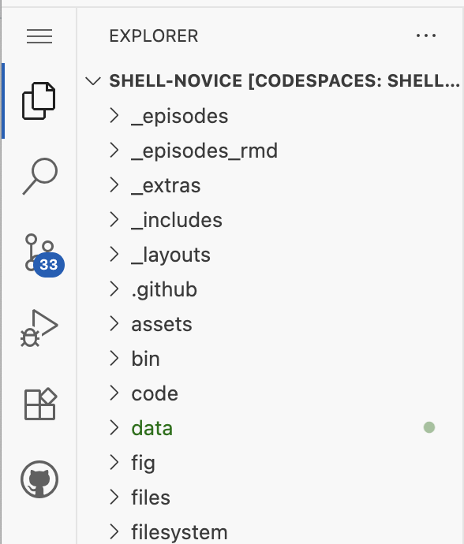

[![Create a Slack Account with us][create_slack_svg]][slack_invite]
[![Slack Status][slack_status_svg]][slack_status]
[![DOI][doi_svg]][doi]

shell-novice
============

**This is a fork that modifies the lesson to use github codespaces**

An introduction to the Unix shell for people who have never used the command line before.

## Environment

**START HERE**

Go to [this link](https://github.com/codespaces?repository_id=623158525) and click on the codespace labelled "shell novice codespace". This will take you to VS Code in your web browser.

* **Note**: It will take a few moments to initialize.
* This is a learning environment! **It is not suitable for processing big data**


### Getting Started with VS Code
<span style="background-color: yellow; font-weight: bold;">TODO:</span>Add screenshots for VS Code. What to expect. Anatomy of the panes.

#### Window panes and menus ####

VS Code is a Microsoft product that can be downloaded for free. It is also integrated in the web browser for github codespaces. This allows us to all be in the same environment, regardless of our laptop operating system.

**Explorer**

On the left hand side of the window, you will see something like the following:



Notice the icon  has a dark border on the left side. That indicates
that the file Explorer is currently active and showing its contents in that pane.

You may click on the other icons to see what they load into the left pane, but we won't be using them much (or at all) in this lesson.  Make sure you click on the file Explorer icon again when you're done looking around.

#### TERMINAL ####

**The prompt**

```
@meekrob ➜ /workspaces/shell-novice (codespace-lessons) $ 
 |      |  |                      | |                 |   |                   |
  github     the current working        repository         your typing appears
 username        directory                branch                  here
```

## Maintainers 

### codespace fork
* David King

### original project

* [Gerard Capes][gerard_capes]
* [Jacob Deppen][jacob_deppen]
* [Benson Muite][benson_muite]

## Contributing

If you would like to contribute to the development of the lesson, you can find details in our
[CONTRIBUTING guide](https://github.com/swcarpentry/shell-novice/blob/gh-pages/CONTRIBUTING.md).
Contributions can come in many different forms: typo and formatting fixes, additions or subtractions
of content, suggestions, clarifications, and more.

[gerard_capes]: https://carpentries.org/instructors/#capes_gerard
[jacob_deppen]: https://deppen8.github.io/
[benson_muite]: https://carpentries.org/instructors/#benson_muite
[lesson-example]: https://carpentries.github.io/lesson-example/
[create_slack_svg]: https://img.shields.io/badge/Create_Slack_Account-The_Carpentries-071159.svg
[slack_invite]: https://swc-slack-invite.herokuapp.com/
[slack_status]: https://swcarpentry.slack.com/messages/C9X3XTHJ8
[slack_status_svg]: https://img.shields.io/badge/Slack_Channel-swc--shell-E01563.svg
[doi]: https://doi.org/10.5281/zenodo.3266823
[doi_svg]: https://zenodo.org/badge/DOI/10.5281/zenodo.3266823.svg
